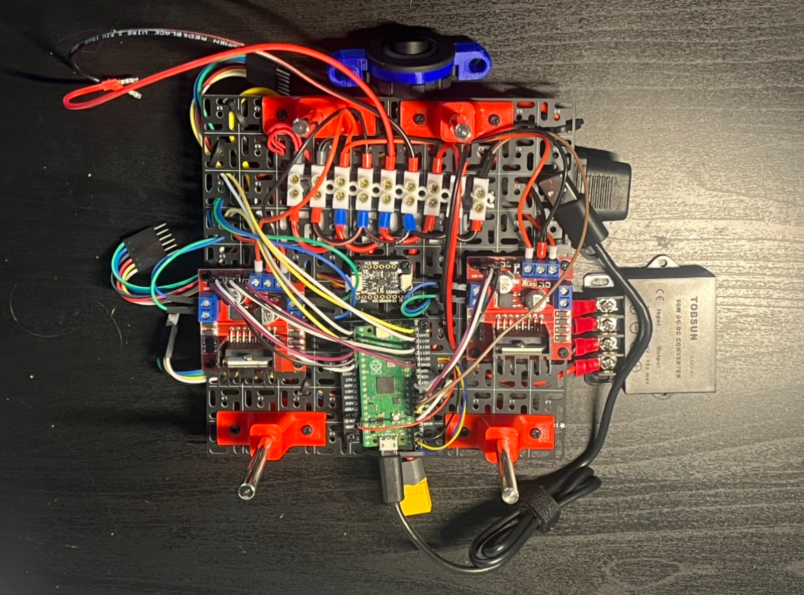
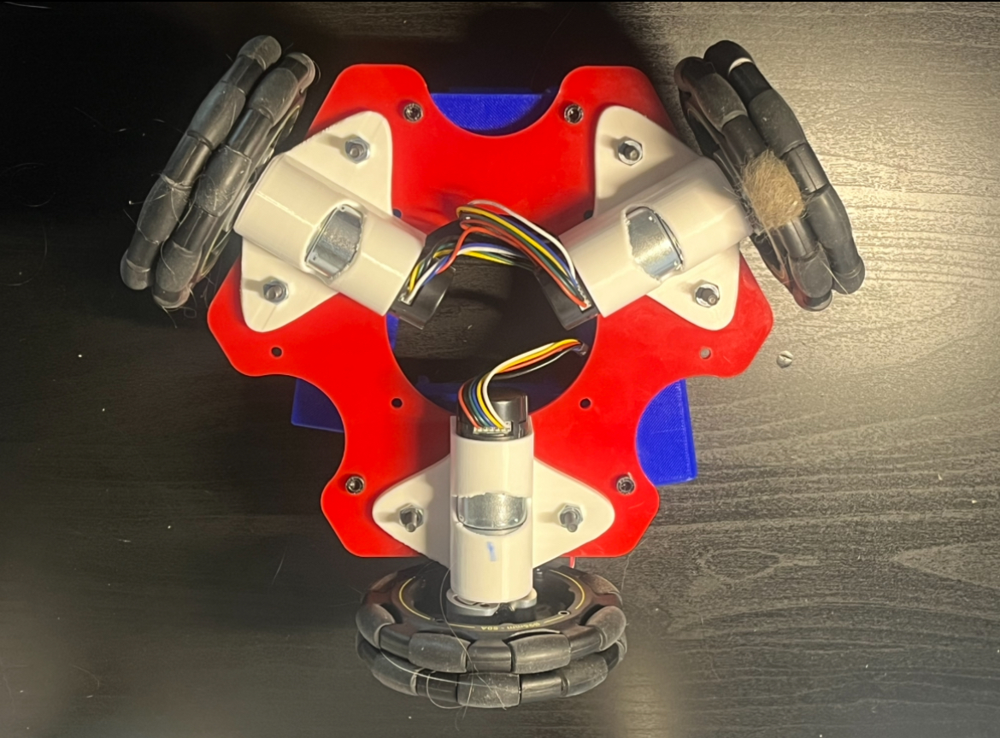

# OMNI BOT
__Author/Creator :__ Dalton Richardson 

### Overview
This repo provides details and code for an in progress omni wheeled controlled robot 
ultilizing ROS 2 on a Raspberry Pi 5 with docker. SLAM capabilites are provided with a 
Realsense D435 depth camera using visual odometry whle motors are tracked and controlled 
using a raspberry pi pico running micro ros. The chasis is structured using 3 stacking 
tiers that include over 10 custom parts designed in Solidworks and fabricated using a 3D printer. 

My goal with this project has been to gain a more familiar understanding of 
the full process that goes into buidling a robot. This includes the designing
 of parts, the setup of wiring and power 
distribution, the development of software, and more.

### Current State

__TODO:__ Write about the current state of work

INSERT VIDEO HERE

## Hardware

### DESIGNED PARTS

All 3D printed parts used were designed using Fusion 360. This includes parts for mounting motors and the camera, structural supports, and a . The STL files for all parts are linked in the Google Drive below.

#### TOP LAYER
<table>
    <tr>
        <td></td>
        <td></td>
    </tr>
</table>

#### MIDDLE LAYER
<table>
    <tr>
        <td></td>
        <td></td>
    </tr>
</table>

#### BOTTOM LAYER
<table>
    <tr>
        <td></td>
        <td></td>
    </tr>
</table>

## Software

The software used to run the robot and SLAM algorithms is interconnected between a seperate PC and the Raspberry Pi. This was done to ease the computational load on the Raspberry Pi and allow for more computationally heavy mapping alogrithms to be used. Compressed RGBD images taken with the Pi are sent using ROS nodes to the PC where the mapping takes place. Currently mapping is done using [RTABMap](https://introlab.github.io/rtabmap/). 

The Raspberry Pi can take commanded velocity from two different source, a game controller connected directly to the Pi or from the PC. Velocities sent from the PC are meant to come from path planning, though this has yet to be sucessfuly implement/completed and remains a work in progress. The Raspberry Pi then communicates with the RPi Pico using micro ros. The RPi Pico assumes the role of converting these commanded velocities into the three wheel velocities. Using quadrature encoders to monitor wheel speed, the pico uses PID controllers to send appropriate voltages to the motors. 

The graphic shown explains the general communication between the different computational elements of the system.

