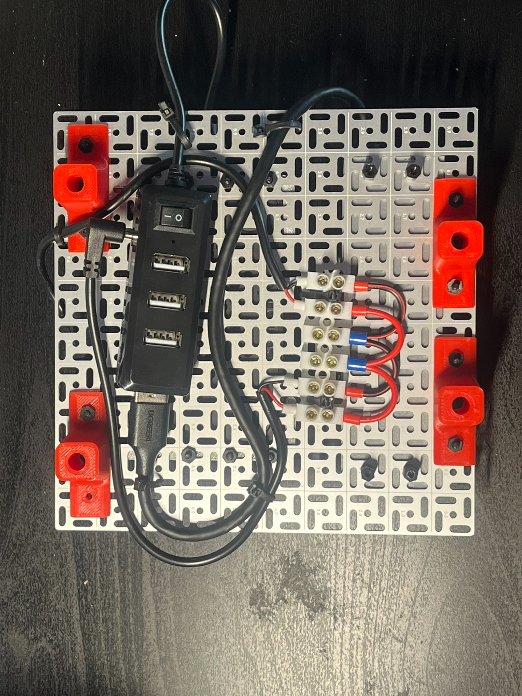

# OMNI BOT
__Author/Creator :__ Dalton Richardson 

### Overview
This repo provides details and code for an in progress omni wheeled robot ultilizing ROS 2 on a Raspberry Pi 5 with docker. SLAM capabilites are provided with a Realsense D435 depth camera using visual odometry whle motors are tracked and controlled using a raspberry pi pico running micro ros. The chasis is structured using 3 stacking tiers that include over 10 custom parts designed in Solidworks and fabricated using a 3D printer. 

My goal with this project has been to gain a more familiar understanding of  the full process that goes into buidling a robot. This includes the designing of parts, the setup of wiring and power distribution, the development of software, and more.

### Current State

Currently, the robot has been succesfully built and tested, with software being the current focus. The micro controller on the Pico is currently 'complete' (though there is room for improvement/modifications in the future) and uses tuned PIDs and quadrature encoders on the motors to precisely and accurately drive the bot in any direction. While I aim to add autonomous control and am working towards this, all successful driving is currently done with a controller.  

SLAM featues including mapping and visual odometry are currently working. Using [RTABMap](https://introlab.github.io/rtabmap/) an occupancy grid and point cloud of the surrounding environment can be made. A screenshot and video demonstrating this in action are shown below. 

TODO: INSERT VIDEO 

## Hardware

### CAD and 3D Printing

A variety of different parts were designed using Autodesk Fusion and fabricated with a 3D printer. The STL files for all parts are linked in the Google Drive [here](https://drive.google.com/drive/folders/1KrRYiB0WbXtAPRXzIc1sEI4wl8nm7dq_?usp=sharing).

### Electrical Wiring

The robot is powered from a 3 cell lipo battery outputting 12 volts. While the motors are controlled from these 12 volts, a buck converter is used to supply 5 volts to the majority of the circuitry. Additionally, the pico and camera are connected to the Raspberry Pi 5 through a externally powered usb hub. This prevents these compenents from sapping too much power from the Raspberry Pi and causing unpredictable behavior. 

WARNING: While I feel good in the power management of the robot, this is certainly the part of the process I knew the least about coming in. Though nothing has blown up (yet), I would be wary of using this as a model of how to properly wire a robot.

### Full Assembly

As prevously mentioned, there are 3 stacking tiers to the robot that each contain different parts of the circuitry and components. 

#### TOP LAYER

Focused on the brains of the bot, the top layer of the bot contains the Raspberry Pi and the Camera. The usb hub on the bottom side of the plate is used to power the camera externally from the Pi. 
<table>
    <tr>
        <td></td>
        <td></td>
    </tr>
</table>

#### MIDDLE LAYER

This layer contains the majority of the wiring and circuitry used in the bot. In addition to the pico, this includes the motor drivers (L298N), a power switch, fuse, and imu. 

<table>
    <tr>
        <td></td>
        <td></td>
    </tr>
</table>

#### BOTTOM LAYER

Acting as the base of the robot, the main purpose of this layer is containing the motors. However, there are also the 3D printed parts in blue which are used to contain the buck converter, lipo battery, and battery display. 
<table>
    <tr>
        <td></td>
        <td></td>
    </tr>
</table>

## Software

The software used to run the robot and SLAM algorithms is interconnected between a seperate PC and the Raspberry Pi. This was done to ease the computational load on the Raspberry Pi and allow for more computationally heavy mapping alogrithms to be used. Compressed RGBD images taken with the Pi are sent using ROS nodes to the PC where the mapping takes place. Currently mapping is done using [RTABMap](https://introlab.github.io/rtabmap/). 

The Raspberry Pi can take commanded velocity from two different source, a game controller connected directly to the Pi or from the PC. Velocities sent from the PC are meant to come from path planning, though this has yet to be sucessfuly implement/completed and remains a work in progress. The Raspberry Pi then communicates with the RPi Pico using micro ros. The RPi Pico assumes the role of converting these commanded velocities into the three wheel velocities. Using quadrature encoders to monitor wheel speed, the pico uses PID controllers to send appropriate voltages to the motors. 

Since the Raspberry Pi 5 OS is incompatible with ROS and the Realsense SDK, which the camera relies on, docker has been used. One docker container is used to run the micro-ros agent enabling communications between the Raspberry Pi and the Pico while the other is used to run ROS directly on the Pi. 

A [seperate repo](https://github.com/daltonri24/Omni_Bot_Pi) is used for the code and files belonging on the Raspberry Pi. This includes the code for micro-ros and the dockerfile being used to run ROS. 

The graphic shown explains the general communication between the different computational elements of the system.

## Future Work

Considering this is the first time I have built a robot entirely from scratch like this, there is plenty of things I want to add or improve on based on the experience so far. 

1. My next plans are to integrate ROS 2 control into the software controlling the bot. This would have many benefits on top of just being cleaner than how I do it now. It would allow for the use of custom controllers such as [this](https://github.com/mateusmenezes95/omnidirectional_controllers?tab=readme-ov-file), make Nav2 much easier to implement (See next point), and allow for the use of gazebo for simulated testing. 

2. Complete autonomous navigation while mapping. While I would love to skip straight to this, I first need to improve the mapping so I have better occupancy grids the navigation can work off of. 

## References

1. [Articulated Robotics](https://www.youtube.com/@ArticulatedRobotics/featured) - Great youtube channel with tutorials on robotics

2. UofM MBot - The robot used by many classes at the University of Michigan. 